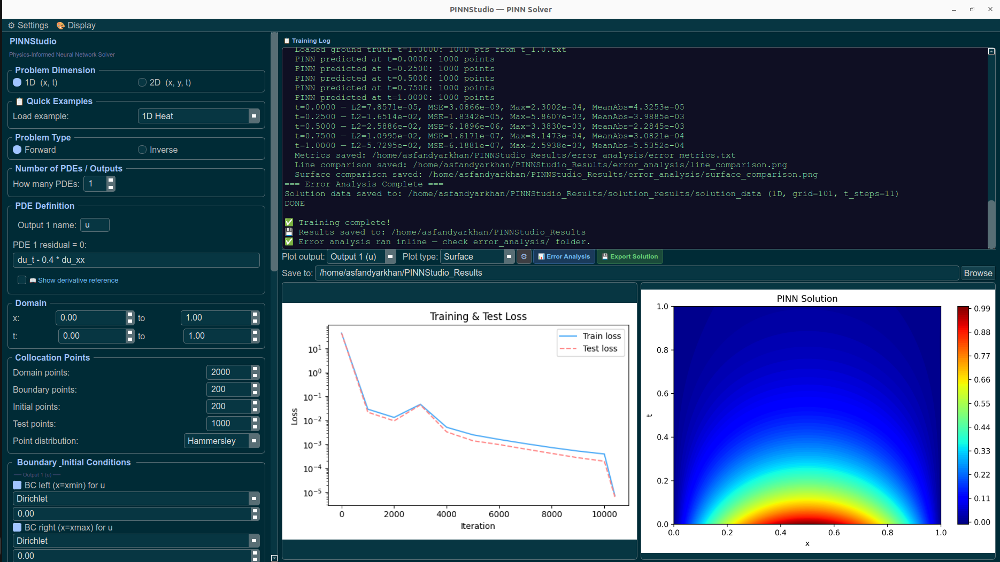
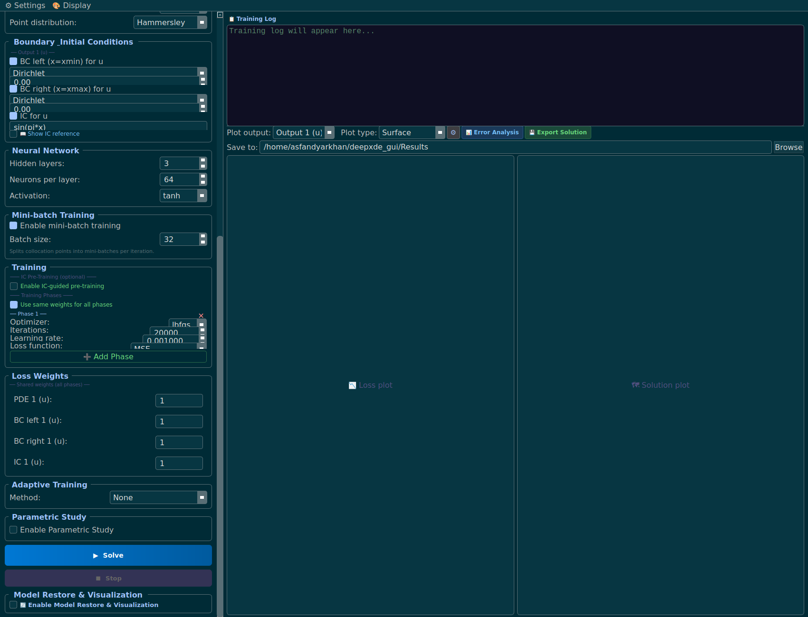
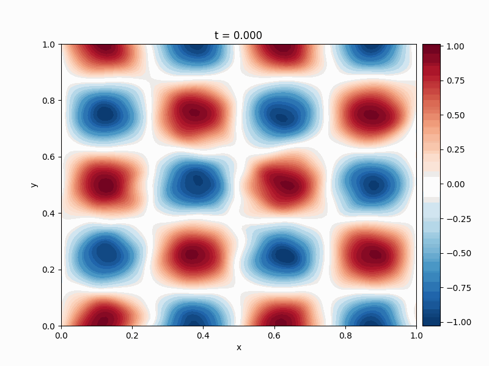
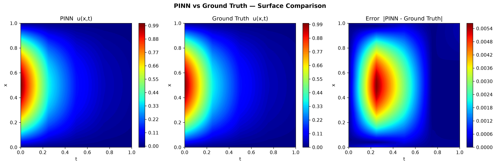
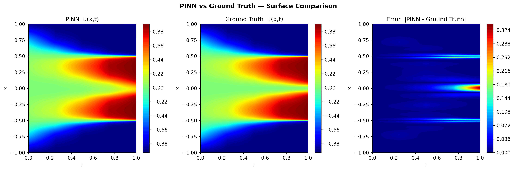
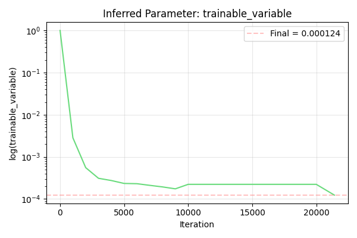

# PINNStudio

*A no-code desktop GUI for building, training, and visualizing Physics-Informed Neural Networks (PINNs) — built on [DeepXDE](https://github.com/lululxvi/deepxde).*

---

## Overview

Setting up a Physics-Informed Neural Network usually means writing a new DeepXDE script for every problem: defining the PDE residual, wiring up boundary and initial conditions, picking collocation points, choosing an optimizer schedule, and writing your own plotting/error-analysis code afterward.

PINNStudio replaces that boilerplate with a form. You describe the problem — the PDE, the domain, the boundary and initial conditions, the network architecture, the training schedule — through the interface, and PINNStudio generates a standalone DeepXDE/PyTorch script, runs it, and streams the training log, loss curves, and solution plots back into the GUI.

It supports both **forward problems** (solve a known PDE) and **inverse problems** (estimate unknown PDE parameters from observation data), in 1D `(x, t)` and 2D `(x, y, t)`, including coupled, multi-output PDE systems.

The goal is to make physics-informed machine learning accessible to researchers who need it but don't want to become deep learning engineers first. Setting up a PINN by hand touches autograd-based residuals, collocation sampling, loss weighting, and optimizer scheduling all at once — details that are easy to get subtly wrong and can cost hours of debugging before a single result can be trusted. PINNStudio lets researchers across science and engineering — materials science, mechanics, chemistry, biology, and beyond — set up and run both forward and inverse PINN problems for their own equations without building that infrastructure from scratch, on a framework that has been thoroughly tested so results are trustworthy from the first run.

## Screenshots

<p align="center">
  
</p>
<p align="center"><em>Problem setup: PDE residual, domain, and collocation points.</em></p>

<p align="center">
  
</p>
<p align="center"><em>Network architecture, multi-phase optimizer schedule, loss weights, and adaptive training.</em></p>

<p align="center">
  
</p>
<p align="center"><em>Time evolution of a PINN solution, reconstructed from a saved checkpoint via Model Restore.</em></p>

## Example Solutions

<p align="center">
  
</p>
<p align="center"><em>1D Heat: PINN-predicted solution against the bundled FEM reference data.</em></p>

<p align="center">
  
</p>
<p align="center"><em>1D Allen-Cahn: PINN-predicted solution against the bundled FEM reference data.</em></p>

<p align="center">
  
</p>
<p align="center"><em>1D Allen-Cahn (Inverse): the unknown diffusion parameter recovered from observation data, converging to its true value during training.</em></p>

## Features

**Problem setup**
- 1D `(x, t)` and 2D `(x, y, t)` problem definitions
- Forward problems and inverse (parameter-estimation) problems
- Free-form PDE residual editor — supports multi-output, coupled PDE systems, not just single equations
- Boundary conditions per side, per output (Dirichlet, Neumann, Periodic), and initial conditions from an expression or a data file
- Collocation point controls (domain / boundary / initial / test point counts, point distribution) with a 2D domain preview
- For inverse problems, the built-in templates auto-load their end-time reference file as the observed-data source and default the observed-data loss weight to 100, so estimating a parameter needs no manual file browsing to get started (still overridable)

**Training**
- Configurable network architecture (hidden layers, neurons per layer, activation)
- Two-stage optimization (Adam + L-BFGS) with detailed L-BFGS settings and configurable float precision
- Multi-phase optimizer scheduling and optional IC-guided pre-training
- Residual-based adaptive refinement (RAR)
- Time-adaptive stepping with transfer learning between time windows
- Mini-batch training
- Live parameter convergence during inverse training — the estimated parameter's value prints and saves periodically throughout training, including during L-BFGS phases, not just at the end

**Templates**
- Seven built-in Quick Example templates covering common phase-field and diffusion problems (see [Built-in Templates](#built-in-templates))

**Analysis & output**
- Live training log streaming, with a Stop control
- Error analysis against reference/ground-truth data (L2, MSE, max error; line and surface comparison plots)
- Configurable result plotting (colormap, resolution, DPI, colorbar, snapshot count)
- Solution data export
- Model restore — reload a saved checkpoint to regenerate plots and re-run error analysis without retraining

## Repository Structure

```text
pinnstudio/
├── pinnstudio/
│   ├── main.py            # Entry point
│   ├── ui/
│   │   └── main_window.py # PyQt6 interface — every tab, dialog, and control
│   └── core/
│       ├── config.py      # PINNConfig — the full problem definition
│       ├── codegen.py     # PINNConfig -> standalone DeepXDE/PyTorch script
│       └── runner.py      # Runs the generated script, streams output to the GUI
├── assets/
│   ├── screenshots/        # README screenshots
│   └── results/             # Example output (restored_animation.gif, solution images)
├── reference_data/          # Bundled FEM ground truth for the built-in templates
│   ├── 1D/
│   └── 2D/
├── requirements.txt
├── setup.py
├── install.sh              # One-command setup (macOS/Linux)
├── install.bat              # One-command setup (Windows)
└── README.md
```

## Quick Start

```bash
git clone https://github.com/AsfandyarKhan72/PINNStudio.git
cd PINNStudio
```

**macOS / Linux:**
```bash
bash install.sh
./venv/bin/pinnstudio
```

**Windows:**
```
install.bat
.\venv\Scripts\pinnstudio.exe
```

The install script creates an isolated virtual environment, installs PINNStudio and its dependencies, and — if it detects an NVIDIA GPU that the default PyTorch build can't use (an older driver, most commonly) — automatically installs a more compatible PyTorch build instead, so GPU support works out of the box on more machines.

Requires Python 3.9+ and git already installed.

**60-second tour:** maximize the window for the best view — PINNStudio packs a lot of controls into the left panel. With the app open, leave the dimension on **1D**, pick **1D Heat** from the *Quick Examples* dropdown, and click **Solve**. The Training Log panel will stream progress, and the loss/solution plots will populate once the run finishes.

## Running PINNStudio Again

You only need to run the install steps above once. After that, launch PINNStudio again anytime with:

**macOS / Linux**, from inside the `PINNStudio` folder:
```bash
./venv/bin/pinnstudio
```

**Windows**, from inside the `PINNStudio` folder:
```
.\venv\Scripts\pinnstudio.exe
```

That's it - no need to reinstall or recreate the virtual environment.

## Installation

It's recommended to use a clean Python environment:

```bash
# macOS / Linux
python3 -m venv venv
source venv/bin/activate

# Windows (Command Prompt or PowerShell)
python -m venv venv
venv\Scripts\activate

pip install --upgrade pip
pip install -r requirements.txt
```

### Core dependencies
- [DeepXDE](https://github.com/lululxvi/deepxde) (PyTorch backend)
- PyTorch
- PyQt6
- NumPy
- Matplotlib
- Pandas

Requires Python 3.9+. A CUDA-capable GPU is optional but recommended for larger 2D problems and inverse runs.

## Built-in Templates

Each template preconfigures the PDE, domain, boundary/initial conditions, network size, and training schedule — pick one from *Quick Examples*, then adjust as needed.

All seven templates ship with bundled FEM reference data (see [`reference_data/`](reference_data)), generated independently of the PINN, so Error Analysis auto-configures against real ground truth the moment you load them — no setup, no external download.

| Template | Dimension | System | Reference data |
|---|---|---|---|
| 1D Heat | 1D | Single PDE | ✅ bundled |
| 1D Allen-Cahn | 1D | Single PDE | ✅ bundled |
| 1D Cahn-Hilliard | 1D | Coupled (2 outputs) | ✅ bundled |
| 2D Heat (Dirichlet/Neumann) | 2D | Single PDE | ✅ bundled |
| 2D Allen-Cahn (Mattey) | 2D | Single PDE | ✅ bundled |
| 2D Allen-Cahn (Wight) | 2D | Single PDE | ✅ bundled |
| 2D Cahn-Hilliard (Wight) | 2D | Coupled (2 outputs) | ✅ bundled |

### 1D Heat

$$\frac{\partial u}{\partial t} = 0.4\,\frac{\partial^2 u}{\partial x^2}, \qquad x \in [0, 1]$$

Initial condition: $u(x, 0) = \sin(\pi x)$. Dirichlet boundaries.

### 1D Allen-Cahn

$$\frac{\partial u}{\partial t} = 0.0001\,\frac{\partial^2 u}{\partial x^2} - 5u^3 + 5u, \qquad x \in [-1, 1]$$

Initial condition: $u(x, 0) = x^2\cos(\pi x)$. Periodic boundaries.

### 1D Cahn-Hilliard

Fourth-order phase separation, split into two coupled second-order equations:

$$\frac{\partial u}{\partial t} = \frac{\partial^2 v}{\partial x^2}, \qquad v = 0.01\,(u^3 - u) - 10^{-6}\,\frac{\partial^2 u}{\partial x^2}, \qquad x \in [-1, 1]$$

Initial condition: $u(x, 0) = -\cos(2\pi x)$. Periodic boundaries.

### 2D Heat (Dirichlet/Neumann)

$$\frac{\partial u}{\partial t} = 0.4\left(\frac{\partial^2 u}{\partial x^2} + \frac{\partial^2 u}{\partial y^2}\right), \qquad (x, y) \in [0, 1]^2$$

Initial condition: $u(x, y, 0) = 0$. Mixed Dirichlet/Neumann boundaries.

### 2D Allen-Cahn (Mattey)

Benchmark problem after Mattey & Ghosh (2022) — see [References](#references).

$$\frac{\partial u}{\partial t} = 0.0001\left(\frac{\partial^2 u}{\partial x^2} + \frac{\partial^2 u}{\partial y^2}\right) - 5(u^3 - u), \qquad (x, y) \in [0, 1]^2$$

Initial condition: $u(x, y, 0) = \sin(4\pi x)\cos(4\pi y)$. Periodic boundaries.

### 2D Allen-Cahn (Wight)

Benchmark problem after Wight & Zhao (2021) — see [References](#references).

$$\frac{\partial u}{\partial t} = 0.00625\left(\frac{\partial^2 u}{\partial x^2} + \frac{\partial^2 u}{\partial y^2}\right) - 10(u^3 - u), \qquad (x, y) \in [0, 1]^2,\ t \in [0, 10]$$

Initial condition: a smooth circular interface, $u(x, y, 0) = \tanh\!\left(\dfrac{0.35 - \sqrt{(x-0.5)^2 + (y-0.5)^2}}{0.05}\right)$. Periodic boundaries.

### 2D Cahn-Hilliard (Wight)

Benchmark problem after Wight & Zhao (2021) — see [References](#references). Two-phase separation, split into a composition field $u$ and a chemical potential $\mu$:

$$\frac{\partial u}{\partial t} = \frac{\partial^2 \mu}{\partial x^2} + \frac{\partial^2 \mu}{\partial y^2}, \qquad \mu = (u^3 - u) - 0.1\left(\frac{\partial^2 u}{\partial x^2} + \frac{\partial^2 u}{\partial y^2}\right), \qquad (x, y) \in [-0.5, 0.5]^2$$

Initial condition: two circular domains of opposite phase. Periodic boundaries.

## How It Works

PINNStudio doesn't wrap DeepXDE at runtime — it **generates code**. Every setting in the GUI maps to a field on a `PINNConfig` dataclass ([`pinnstudio/core/config.py`](pinnstudio/core/config.py)); clicking **Solve** passes that config to [`codegen.py`](pinnstudio/core/codegen.py), which writes out a complete, standalone DeepXDE/PyTorch script, and [`runner.py`](pinnstudio/core/runner.py) executes it as a subprocess, streaming stdout back into the Training Log panel in real time.

Because the output of every run is an ordinary Python script, you can take it and run it outside the GUI, hand it to a cluster job, or use it as a starting point for a hand-written DeepXDE project.

## Citation

If PINNStudio is useful in your work, please cite it — see [`CITATION.cff`](CITATION.cff):

```bibtex
@software{khan2026pinnstudio,
  author  = {Khan, Asfandyar},
  title   = {PINNStudio: A No-Code GUI for Physics-Informed Neural Networks},
  year    = {2026},
  url     = {https://github.com/AsfandyarKhan72/PINNStudio}
}
```

## References

- Lu, L., Meng, X., Mao, Z., & Karniadakis, G. E. (2021). DeepXDE: A deep learning library for solving differential equations. *SIAM Review*, 63(1), 208–228. https://doi.org/10.1137/19M1274067
- Mattey, R., & Ghosh, S. (2022). A novel sequential method to train physics informed neural networks for Allen-Cahn and Cahn-Hilliard equations. *Computer Methods in Applied Mechanics and Engineering*, 390, 114474. https://doi.org/10.1016/j.cma.2021.114474
- Wight, C. L., & Zhao, J. (2021). Solving Allen-Cahn and Cahn-Hilliard equations using the adaptive physics informed neural networks. *Communications in Computational Physics*, 29(3), 930–954. https://doi.org/10.4208/cicp.OA-2020-0086

## Acknowledgment

PINNStudio is built on [DeepXDE](https://github.com/lululxvi/deepxde) (Lu et al., 2021) and PyQt6. The 2D Allen-Cahn and Cahn-Hilliard Quick Example templates follow the problem setups described in Mattey & Ghosh (2022) and Wight & Zhao (2021) — see [References](#references).

Developed under the supervision of Prof. Mahmood Mamivand, Computational Materials Design Lab, Boise State University.

The authors appreciate the support of the National Science Foundation grant DMR-2142935. We would like to acknowledge the high-performance computing support of the Borah compute cluster (DOI: 10.18122/oit/3/boisestate) provided by Boise State University's Research Computing Department.

## Contributing

Bug reports, feature requests, and pull requests are welcome — see [`CONTRIBUTING.md`](CONTRIBUTING.md).

## Contact

Asfandyar Khan
PhD Candidate, Materials Science and Engineering
Boise State University
Email: [asfandyarkhan@u.boisestate.edu](mailto:asfandyarkhan@u.boisestate.edu)

## License

Released under the MIT License. See [`LICENSE`](LICENSE) for details.
