# PINNStudio

*A no-code scientific computing environment for building, training, and visualizing Physics-Informed Neural Networks (PINNs) — built on [DeepXDE](https://github.com/lululxvi/deepxde).*

<p align="center">
  <a href="https://pypi.org/project/pinnstudio/"></a>
  <a href="https://pepy.tech/project/pinnstudio"></a>
  <a href="https://pypi.org/project/pinnstudio/"></a>
  <a href="LICENSE"></a>
  <a href="https://github.com/AsfandyarKhan72/PINNStudio/stargazers"></a>
  <a href="https://github.com/AsfandyarKhan72/PINNStudio/commits/main"></a>
</p>

<p align="center">
  <em>One PDE, three dimensions — the same panel drives all of them, solved and visualized entirely within PINNStudio.</em>
</p>

<table>
<tr>
<td width="33%" align="center">
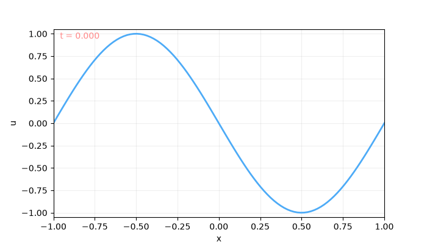
<sub><strong>1D</strong> — <code>(x, t)</code> — Burgers</sub>
</td>
<td width="33%" align="center">

<sub><strong>2D</strong> — <code>(x, y, t)</code> — Allen-Cahn (Wight & Zhao)</sub>
</td>
<td width="33%" align="center">

<sub><strong>3D</strong> — <code>(x, y, z, t)</code> — Heat</sub>
</td>
</tr>
</table>

<p align="center">
  <strong><a href="https://asfandyarkhan72.github.io/PINNStudio/">Website</a></strong> &nbsp;·&nbsp;
  <strong><a href="#quick-start">Quick Start</a></strong> &nbsp;·&nbsp;
  <strong><a href="#built-in-templates">Templates</a></strong> &nbsp;·&nbsp;
  <strong><a href="#getting-started-with-your-own-pde">Your Own PDE</a></strong> &nbsp;·&nbsp;
  <strong><a href="https://github.com/AsfandyarKhan72/PINNStudio/discussions">Discussions</a></strong> &nbsp;·&nbsp;
  <strong><a href="#citation">Citation</a></strong>
</p>

<details>
<summary><strong>Table of contents</strong></summary>

- [Quick Install](#quick-install)
- [Overview](#overview)
- [Demo Video](#demo-video)
- [Features](#features)
- [Repository Structure](#repository-structure)
- [Quick Start](#quick-start)
- [Running PINNStudio Again](#running-pinnstudio-again)
- [What Gets Installed](#what-gets-installed)
- [Built-in Templates](#built-in-templates)
- [Getting Started with Your Own PDE](#getting-started-with-your-own-pde)
- [How It Works](#how-it-works)
- [Citation](#citation)
- [References](#references)
- [Acknowledgment](#acknowledgment)
- [Contributing](#contributing)
- [Contact](#contact)
- [License](#license)

</details>

---

## Quick Install

**The fastest way to try PINNStudio** (any OS, no GPU-driver matching):

```bash
pip install pinnstudio
pinnstudio
```

**Have an NVIDIA GPU?** Use the full install script instead - it detects your GPU and automatically installs a matching PyTorch build for you, which the plain pip install above does not do. See [Quick Start](#quick-start) below.

<details>
<summary><strong>Command not found after <code>pip install</code>?</strong></summary>

- **<code>pip: command not found</code>?** Use <code>pip3</code> instead - many systems (macOS especially) only ship <code>pip3</code>, not a plain <code>pip</code>.
- **<code>pinnstudio: command not found</code> even though the install said it succeeded?** pip installed it into a per-user folder that is not on your shell's PATH yet. The install output actually tells you the exact folder, in a line like <code>WARNING: The script pinnstudio is installed in '.../bin' which is not on PATH.</code> Add that folder to your PATH:

```bash
echo 'export PATH="<folder from the warning above>:$PATH"' >> ~/.zshrc
source ~/.zshrc
```

(Use <code>~/.bashrc</code> instead of <code>~/.zshrc</code> if your shell is bash.) Then <code>pinnstudio</code> should launch directly. This never comes up with <code>install.sh</code>/<code>install.bat</code>, since those use a virtual environment where the command is always found automatically.

- **The suggested GPU fix command itself fails with a <code>flit_core</code> or "Could not find a version that satisfies" error?** Your pip is too old to resolve PyTorch's package index correctly. Upgrade it first, then retry:

```bash
python -m pip install --upgrade pip
pip install torch --index-url https://download.pytorch.org/whl/cu121 --force-reinstall
```

</details>

---

## Overview

Setting up a Physics-Informed Neural Network usually means writing a new DeepXDE script for every problem: defining the PDE residual, wiring up boundary and initial conditions, picking collocation points, choosing an optimizer schedule, and writing your own plotting/error-analysis code afterward.

PINNStudio replaces that boilerplate with a form. You describe the problem — the PDE, the domain, the boundary and initial conditions, the network architecture, the training schedule — through the interface, and PINNStudio generates a standalone DeepXDE/PyTorch script, runs it, and streams the training log, loss curves, and solution plots back into the GUI.

It supports both **forward problems** (solve a known PDE) and **inverse problems** (estimate unknown PDE parameters from observation data), across **1D (`x`), 2D (`x, y`), and 3D (`x, y, z`)** — time-dependent (with a `t` axis) or steady-state (without one) — including coupled, multi-output PDE systems. The domain itself isn't limited to a box either — 2D problems can be posed on a rectangle, disk, ellipse, triangle, or arbitrary polygon, and 3D problems on a cuboid or sphere; any of those primitives can also be combined into a custom shape with boolean union/subtract/intersect operations (e.g. a cavity with an obstacle cut out of it), so a re-entrant-corner, curved-boundary, or multi-shape problem doesn't need any code of your own to set up.

The goal is to make physics-informed machine learning accessible to researchers who need it but don't want to become deep learning engineers first. Setting up a PINN by hand touches autograd-based residuals, collocation sampling, loss weighting, and optimizer scheduling all at once — details that are easy to get subtly wrong and can cost hours of debugging before a single result can be trusted. PINNStudio lets researchers across science and engineering — materials science, mechanics, chemistry, biology, and beyond — set up and run both forward and inverse PINN problems for their own equations without building that infrastructure from scratch, on a framework that has been thoroughly tested so results are trustworthy from the first run.

## Demo Video

[](https://youtu.be/lxSJTJvU45Q)

*Click to watch a full walkthrough of the PDE setup panel on YouTube.*

## Features

### Problem Setup

<details>
<summary><strong>1D, 2D, and 3D problem definitions</strong></summary>

Every problem is defined over `(x, t)`, `(x, y, t)`, or `(x, y, z, t)` — switching dimension in the Setup panel rebuilds the relevant controls (geometry selector, boundary condition rows, plot options) for you, so nothing from a previous dimension is left over and silently wrong. Steady-state (time-independent) problems are supported in every dimension too — turn off the time axis and the network trains a pure `u(x)`, `u(x, y)`, or `u(x, y, z)` instead.

</details>

<details>
<summary><strong>Forward and inverse problems</strong></summary>

**Forward**: the PDE's parameters are known — PINNStudio solves for the field itself. **Inverse**: one or more PDE parameters are unknown, and PINNStudio estimates them from observation data (a reference solution file) while solving for the field simultaneously. Every built-in template supports both modes; switching to Inverse auto-loads that template's own end-time reference file as the observed-data source and defaults its loss weight to 100, so estimating a parameter needs no manual file browsing to get started (still fully overridable). Multiple unknown parameters in the same problem are supported, not just one.

</details>

<details>
<summary><strong>Free-form, multi-output PDE editor</strong></summary>

Write the PDE residual directly as an expression, not through a fixed set of presets. Derivatives use a plain `d<output>_<vars>` naming convention — `du_x`, `du_xx`, `du_t`, `du_xy`, `du_xt`, all the way up to mixed fourth-order terms like `du_xxyy` or `du_xxtt` — so anything from a first-order diffusion term to a coupled, higher-order system is expressible without touching any generated code. Multi-output, coupled PDE systems (naming a second output `v` gives you `dv_x`, `dv_t`, and so on, alongside `u`'s own) are supported the same way — the 2D Burgers and 1D Schrödinger templates below are both two-output coupled systems set up entirely through this editor.

</details>

<details>
<summary><strong>Boundary and initial conditions</strong></summary>

Boundary conditions are added as rows in a panel, each with its own type (Dirichlet, Neumann, Robin, Periodic, Point Set from a data file, or an advanced Operator/Interface condition), the output it applies to, and a `True`/`False` location expression in `x`, `y`, `z` that picks out which boundary it means (e.g. `x >= 1`) — compared against your own domain bounds, not a hardcoded number, so the same row still makes sense if you change the domain later. Initial conditions are set from an expression in `x` (`y`, `z` too in 2D/3D) or loaded from a data file, per output.

</details>

<details>
<summary><strong>Geometry & domains</strong></summary>

2D problems aren't limited to a rectangle: **Rectangle, Disk, Ellipse, Triangle,** and arbitrary **Polygon** (given as a vertex list) are all selectable geometries, each with its own domain-preview and parameter panel. 3D problems support **Cuboid** and **Sphere**. Picking a non-box shape doesn't change how you write BCs — the same location-expression convention still works, since DeepXDE only ever evaluates it on points already confirmed to be on that shape's boundary.

Need a shape that isn't one of those on its own? **Custom** geometry (2D and 3D) lets you stack any number of the primitives above and combine each one with the running result via a boolean **Union**, **Subtract**, or **Intersect** — the way to build something like a cavity with an obstacle cut out of it, without writing any CSG code by hand. The example below is a `Triangle` with a `Disk` subtracted out of it (a two-shape Custom chain), the same construction behind this project's own MHD mixed-convection validation case:

<p align="center">
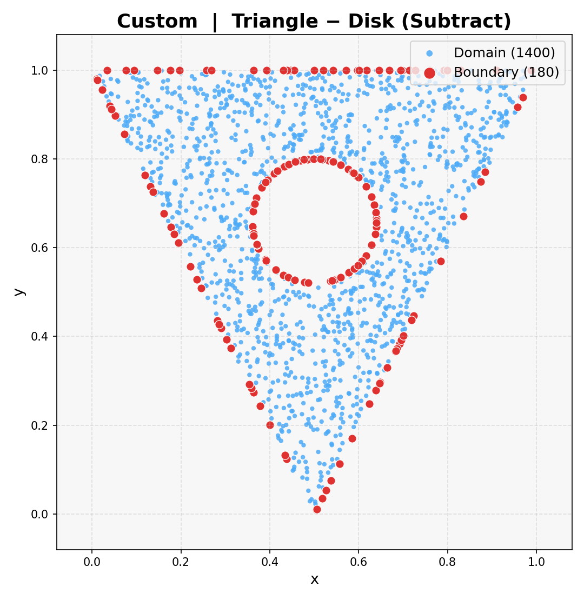
</p>

</details>

<details>
<summary><strong>Collocation point controls</strong></summary>

Domain, boundary, initial, and test point counts are all independently configurable, along with the sampling distribution, plus a live domain preview — a real, non-uniform PDE-collocation point cloud (domain points, boundary points, and initial-condition points, color-coded) plotted directly against your actual geometry, alongside a second panel showing the same points' distribution over time — so you can see exactly what will be handed to training before you click Solve. This works in 2D against any of the five 2D shapes (Rectangle, Disk, Ellipse, Triangle, Polygon) and in 3D too, with a real 3D scatter plot against a Cuboid or Sphere outline, not just a flat 2D preview.

<table>
<tr>
<td width="33%" align="center">
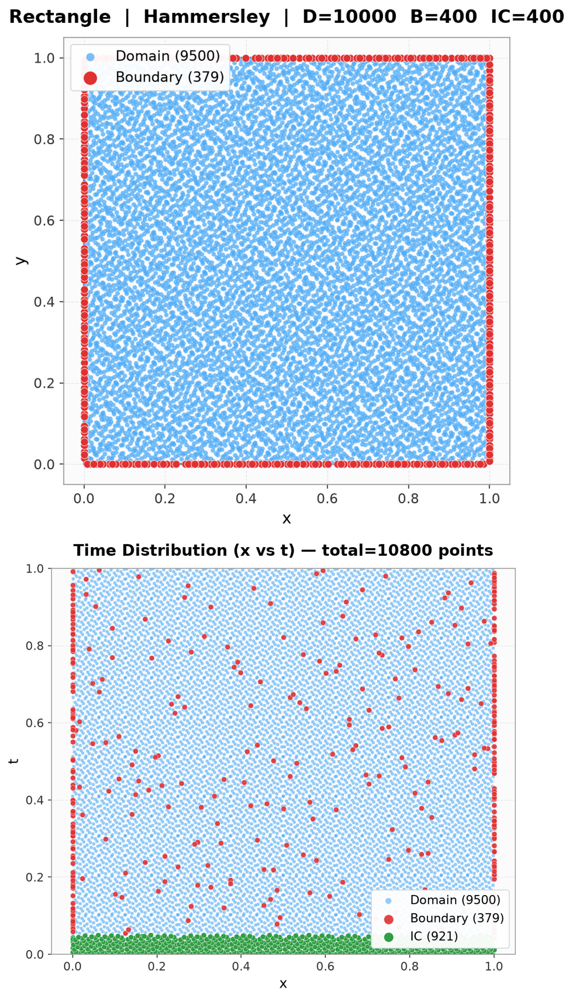
<sub>2D preview — Rectangle</sub>
</td>
<td width="33%" align="center">
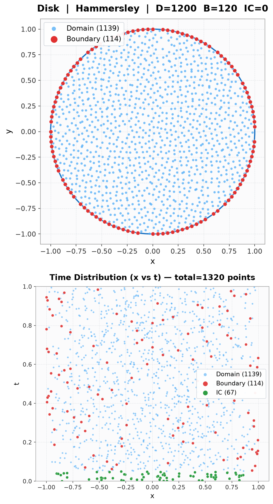
<sub>2D preview — Disk</sub>
</td>
<td width="33%" align="center">
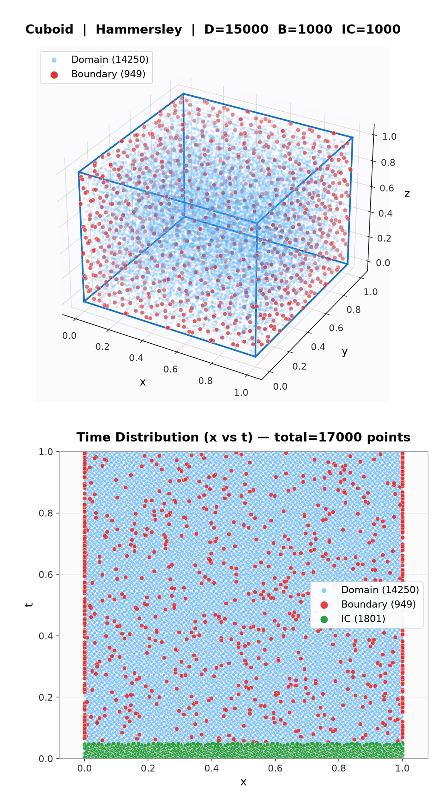
<sub>3D preview — Cuboid</sub>
</td>
</tr>
</table>

</details>

### Training

<details>
<summary><strong>Configurable network architecture</strong></summary>

Hidden layer count, neurons per layer, activation function (tanh, ReLU, sigmoid, swish), and kernel initializer (Glorot uniform, Glorot normal, He uniform, He normal, zeros) are all exposed directly — no need to edit a script to try a wider or deeper network, a different nonlinearity, or a different weight initialization.

</details>

<details>
<summary><strong>Input/output scaling</strong></summary>

Optional affine rescaling on the way into and out of the network — $x_{\text{transformed}} = x_{\text{raw}} \times \text{scale} + \text{shift}$ per input dimension, and the same for each output — off by default (scale = 1, shift = 0 is the identity). Useful when a problem's natural coordinate or solution range is far from the network's comfortable operating range (e.g. a domain spanning thousands of units, or a solution that's always around $10^{-6}$) and normalizing it improves training behavior.

</details>

<details>
<summary><strong>Two-stage optimization (Adam + L-BFGS)</strong></summary>

Every run trains with Adam first, then hands off to L-BFGS for the second stage — a standard, effective PINN training recipe — with L-BFGS's own convergence settings exposed, and a configurable float precision (float32 for speed, float64 when L-BFGS needs the extra precision to converge cleanly).

</details>

<details>
<summary><strong>Multi-phase optimizer scheduling and IC-guided pre-training</strong></summary>

Beyond the basic two-stage recipe, training can be broken into any number of phases (different optimizers, iteration counts, and loss weights per phase), and an optional IC-guided pre-training pass can warm-start the network toward the initial condition before the full PDE-residual loss is even switched on — useful for problems where a cold-start network otherwise struggles to find the right basin.

</details>

<details>
<summary><strong>Residual-based Adaptive Refinement (RAR)</strong></summary>

Periodically resamples collocation points toward wherever the PDE residual is currently largest, concentrating training effort on the hardest parts of the domain (a sharp front, a boundary layer) instead of spreading points uniformly the whole time. Supported in every dimension.

</details>

<details>
<summary><strong>Time-Adaptive training</strong></summary>

Splits the time domain into a sequence of step groups and trains through them in order, optionally with transfer learning so each step warm-starts from the previous one's converged weights instead of training from scratch — effective for problems with a wide time window or fast-evolving dynamics that a single training pass struggles to fit all at once (see the two 2D Allen-Cahn templates below, both wide time windows that ship with Time-Adaptive on by default for exactly this reason). It works in 1D, 2D, and 3D alike.

One setting is worth understanding before using it in 3D: the "IC grid resolution" control is a *per-axis* point count for the grid handed between steps — 1D uses it directly, 2D squares it, and 3D **cubes** it, so a value that's perfectly reasonable in 1D/2D (101, say — 101² ≈ 10,201 points in 2D) becomes over a million points per step in 3D. PINNStudio defaults this to a 3D-safe value automatically when you switch into 3D, and shows an in-panel warning if you manually pick a larger one anyway — both added after exactly this scenario ran a real GPU out of memory partway through a 3D run.

</details>

<details>
<summary><strong>Training callbacks — early stopping, checkpointing, time budget</strong></summary>

Three optional, independently configurable callbacks, alongside Point Resampling (RAR, described above): **Early Stopping** halts training once the monitored loss (training or testing) stops improving by more than a minimum delta for a set number of iterations, with an optional baseline loss and a minimum iteration count before it can trigger. **Model Checkpoint** periodically saves the model during training — on a fixed iteration interval, either unconditionally or only when the monitored loss improves — which is also what makes a run resumable later through Restore & Visualize. **Training Timer** stops training after a wall-clock time budget (in minutes) regardless of iteration count, useful for a shared or time-limited machine.

*Note: an earlier version of PINNStudio had a separate "Mini-batch training" option. It's gone — DeepXDE's `PDE`/`TimePDE` data classes ignore the `batch_size` argument entirely for this training pattern, so it was a no-op that changed nothing. Point Resampling (RAR) is the actual mechanism DeepXDE recommends in its place, and PINNStudio already implements it.*

</details>

<details>
<summary><strong>Live parameter convergence (Inverse mode)</strong></summary>

For an inverse problem, the estimated parameter's value is logged and saved periodically throughout training — including during the L-BFGS phase, not just once at the very end — so you can watch it converge (or fail to) as training progresses, and plot its convergence history afterward as a static figure or an animated GIF. When the parameter's true value is known (every built-in template's Inverse setup, or one you supply yourself), both the plot and the GIF draw it as a dashed reference line alongside the run's own final estimate — including when you revisit an older run through Restore & Visualize's Parameter Convergence Plot/Animation, which reads the true value back from that run's saved `model_config.json`, or lets you type one in directly.

</details>

### Parameter Sweep

<details>
<summary><strong>Run many training configurations from one setup, varying any parameter</strong></summary>

Rather than clicking Solve once per configuration and tracking the results yourself, tick **Enable Parameter Sweep** in the left panel (directly below Adaptive Training) and PINNStudio runs a whole batch of training configurations in sequence — each one a full, independent training run of the problem you've already set up, varying whichever parameter(s) you choose. The shared **Solve**/**Stop** buttons drive it (relabeled **Run Sweep** while a sweep is enabled), and the Training Log streams every run's progress in order, so nothing about the rest of the workflow changes.

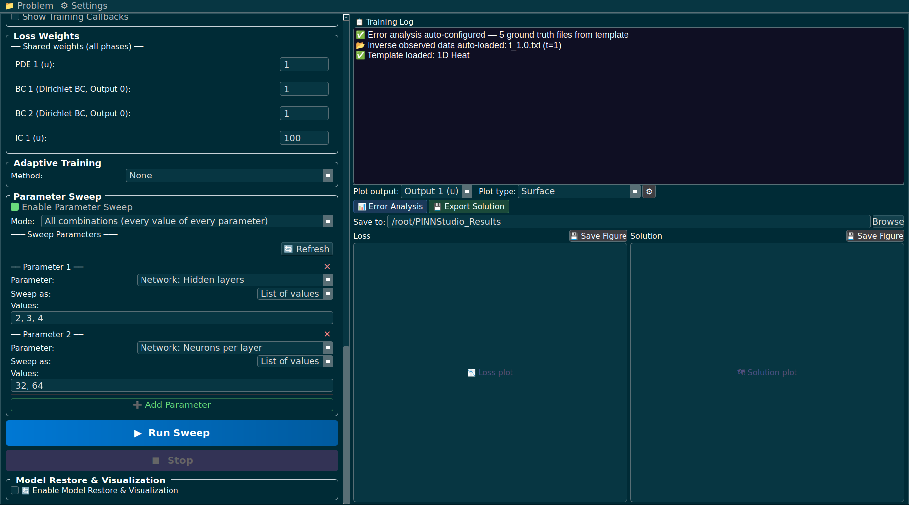

**Three ways to combine parameters**, picked from the Mode dropdown:
- **One-at-a-time** — vary each parameter separately against the same baseline (N+1 values across 2 parameters → 1 baseline + N runs per parameter).
- **All combinations** (grid) — every value of every parameter, crossed together (2 parameters with 3 and 2 values → 6 runs).
- **Specified combinations** (zip) — pair up each parameter's *i*-th value across all parameters (2 parameters with matching-length value lists, paired index-for-index).

Each parameter row takes a comma-separated list of values, or a linear/log numeric range (min, max, number of steps); categorical parameters (activation, point distribution, etc.) are always a plain list of choices.

**Essentially anything you can configure elsewhere in the GUI can be swept** — click **Refresh** on the Parameter dropdown to see everything currently available for your problem, which adapts to what's selected. This currently spans:

- **Network** — hidden layers, neurons per layer, activation, kernel initializer, weight decay.
- **Collocation Points** — domain/boundary/initial/test point counts, sampling distribution.
- **Training Phases** — each Optimizer Scheduler phase's own iterations, learning rate, and optimizer.
- **Loss Weights** — every PDE/BC/IC loss weight, per phase or shared across all phases.
- **Inverse** (when Inverse mode is selected) — each trainable variable's initial guess, each observed-data file's loss weight.
- **RAR** (when selected as the adaptive method) — training rounds, residual sampling points, points added per cycle, Adam/L-BFGS iterations.
- **Time Adaptive** (when selected as the adaptive method) — each time-step group's own step count, IC grid resolution.
- **Input/Output Transform** (when enabled) — each input axis's and each output's own scale value.

**Every run gets its own results.** Each configuration trains into its own subfolder (under the same **Save to:** location as a normal Solve) with its own saved model checkpoint, loss/solution plots, and (if configured) Error Analysis metrics — plus an auto-generated `sweep_manifest.json` and `sweep_summary.csv` at the sweep's root, one row per run, recording its status, final loss, L2 relative error (if Error Analysis is configured), and folder name. Once the sweep finishes, the right panel's Loss/Solution plots fill in with the last successfully completed run's own figure, the same as a normal Solve would show. **Stop** hard-stops the in-flight run immediately rather than letting it finish first.

</details>

### Analysis & Output

<details>
<summary><strong>Live training log</strong></summary>

Training runs as a background process with its stdout streamed straight into the Training Log panel in real time, with a Stop control that actually terminates the running process rather than just detaching from it.

</details>

<details>
<summary><strong>Error analysis against reference data</strong></summary>

Point a run at one or more reference solution files (at one or more time snapshots) and PINNStudio reports, for predicted values $u_{\text{pred}}$ against ground truth $u_{\text{true}}$ over $N$ evaluation points:

$$\Large L_2 \text{ relative error} = \frac{\lVert u_{\text{pred}} - u_{\text{true}} \rVert_2}{\lVert u_{\text{true}} \rVert_2}, \qquad \text{MSE} = \frac{1}{N}\sum_{i=1}^{N}\left(u_{\text{pred},i} - u_{\text{true},i}\right)^2$$

$$\Large \text{Max error} = \max_i \left| u_{\text{pred},i} - u_{\text{true},i} \right|, \qquad \text{Mean absolute error} = \frac{1}{N}\sum_{i=1}^{N}\left| u_{\text{pred},i} - u_{\text{true},i} \right|$$

alongside line-comparison and surface-comparison plots of the PINN prediction against ground truth. All twelve built-in templates ship with bundled reference data so this works immediately with no setup; it works the same way for a data file of your own.

</details>

<details>
<summary><strong>Configurable result plotting</strong></summary>

Static Surface or Line plots, or animated GIFs of either over time, with colormap, contour resolution, DPI, colorbar, and snapshot-count all configurable. For a 1D time-dependent Surface plot (static or animated), the two axes can be swapped between "x on the x-axis, t on the y-axis" and the reverse — whichever reads more naturally for your problem.

</details>

<details>
<summary><strong>Solution data export</strong></summary>

The raw predicted solution — not just the rendered plot — is saved alongside the run's other output, so it's available for your own downstream analysis outside the GUI.

</details>

<details>
<summary><strong>Export as a standalone DeepXDE script</strong></summary>

Every configured problem can be exported as a clean, dependency-minimal DeepXDE/PyTorch script (<code>File → Export as DeepXDE Script...</code>) — the same script the GUI itself would run, but meant to be read and handed off: to a cluster job, a collaborator without PINNStudio installed, or as a starting point for a hand-written project.

</details>

### Restore & Visualize

<details>
<summary><strong>Reload a saved checkpoint — no retraining needed</strong></summary>

Point the Restore panel at a saved model checkpoint and its <code>model_config.json</code>, and PINNStudio reloads the trained network and regenerates whichever visualization you ask for — a static Surface or Line plot, an animated GIF of either, or (for a saved Inverse run) the parameter convergence history — without retraining anything. An animated result plays directly in the panel, the same as it would right after a fresh Solve, and Error Analysis re-runs against the same reference data if it was configured for that run originally.

</details>

## Repository Structure

```text
pinnstudio/
├── pinnstudio/
│   ├── main.py            # Entry point
│   ├── ui/
│   │   └── main_window.py # PyQt6 interface — every tab, dialog, and control
│   └── core/
│       ├── config.py          # PINNConfig — the full problem definition
│       ├── codegen.py         # PINNConfig -> standalone DeepXDE/PyTorch script
│       ├── runner.py          # Runs the generated script, streams output to the GUI
│       ├── sweep_registry.py  # Parameter Sweep's list of sweepable parameters
│       └── sweep_runner.py    # Builds and runs each sweep configuration in turn
├── assets/
│   ├── screenshots/        # README screenshots
│   └── results/             # Example output (solution images, demo GIFs)
├── reference_data/          # Bundled ground truth for the built-in templates
│   ├── 1D/
│   ├── 2D/
│   └── 3D/
├── requirements.txt
├── setup.py
├── install.sh              # One-command setup (macOS/Linux)
├── install.bat              # One-command setup (Windows)
└── README.md
```

## Quick Start

### Step 1: Open a terminal

- **Windows:** click the Start menu, type `PowerShell`, and open **Windows PowerShell**.
- **macOS:** press `Cmd + Space` to open Spotlight, type `Terminal`, and press Enter (or find it under Applications -> Utilities -> Terminal).
- **Linux:** open your terminal application (commonly `Ctrl + Alt + T`, or search "Terminal" in your application menu).

### Step 2: Check you have git and Python 3.9+

Paste these one at a time:

```bash
git --version
python3 --version
```

(On Windows, use `python --version` instead of `python3 --version`.)

If either command isn't recognized:

- **git missing?** Install it from [git-scm.com/downloads](https://git-scm.com/downloads). Default options are fine. On macOS, running `git --version` for the first time may itself prompt you to install Apple's Command Line Tools — accept and let it finish, then try again.
- **Python missing, or older than 3.9?** Install it from [python.org/downloads](https://www.python.org/downloads/). **On Windows, check "Add python.exe to PATH"** on the installer's first screen — this is the single most common thing people miss.

After installing either one, close your terminal window completely and open a new one before continuing, so the change takes effect.

### Step 3: Clone and install

```bash
git clone https://github.com/AsfandyarKhan72/PINNStudio.git
cd PINNStudio
```

**macOS / Linux:**
```bash
bash install.sh
./venv/bin/pinnstudio
```

**Windows:**
```
install.bat
.\venv\Scripts\pinnstudio.exe
```

The install script creates an isolated virtual environment inside the `PINNStudio` folder and installs PINNStudio and its dependencies into it — nothing is installed system-wide, and deleting the folder removes it completely. If it detects an NVIDIA GPU that the default PyTorch build can't use (an older driver, most commonly), it automatically installs a more compatible PyTorch build instead, so GPU support works out of the box on more machines. This step needs an internet connection and can take a few minutes.

> **Already have a working PyTorch + CUDA setup, or no GPU at all?** You can also install with `pip install pinnstudio` - just be aware it skips the GPU compatibility check above, so if you hit a GPU-related error afterward, re-run `install.sh` / `install.bat` instead.

### Step 4: Take the 60-second tour

Maximize the window for the best view — PINNStudio packs a lot of controls into the left panel. With the app open, leave the dimension on **1D**, pick **1D Heat** from the *Quick Examples* dropdown, and click **Solve**. The Training Log panel will stream progress, and the loss/solution plots will populate once the run finishes.

### Something not working?

Open an issue on GitHub with the exact command you ran and the full error message — see [Contributing](#contributing).

## Running PINNStudio Again

You only need to run the install steps above once. After that, launch PINNStudio again anytime with:

**macOS / Linux**, from inside the `PINNStudio` folder:
```bash
./venv/bin/pinnstudio
```

**Windows**, from inside the `PINNStudio` folder:
```
.\venv\Scripts\pinnstudio.exe
```

That's it - no need to reinstall or recreate the virtual environment.

## What Gets Installed

`install.sh` / `install.bat` (used in Quick Start above) set up an isolated Python virtual environment and install:

- [DeepXDE](https://github.com/lululxvi/deepxde) (PyTorch backend)
- PyTorch
- PyQt6
- NumPy
- Matplotlib
- Pandas

A CUDA-capable GPU is optional but recommended for larger 2D/3D problems and inverse runs.

## Built-in Templates

Each template preconfigures the PDE, domain, boundary/initial conditions, network size, and training schedule — pick one from *Quick Examples*, then adjust as needed. All twelve support both **Forward** and **Inverse** mode.

All twelve templates ship with bundled reference data (see [`reference_data/`](reference_data)), generated independently of the PINN, so Error Analysis auto-configures against real ground truth the moment you load them — no setup, no external download.

| Template | Dimension | Regime | Geometry | Reference |
|---|---|---|---|---|
| [1D Heat](#1d-heat) | 1D | Time-dependent | Interval | — |
| [1D Allen-Cahn](#1d-allen-cahn) | 1D | Time-dependent | Interval | Wight & Zhao (2021) |
| [1D Burgers](#1d-burgers) | 1D | Time-dependent | Interval | Raissi et al. (2019) |
| [1D Schrödinger](#1d-schrödinger) | 1D | Time-dependent | Interval | Raissi et al. (2019) |
| [2D Heat](#2d-heat) | 2D | Time-dependent | Rectangle | — |
| [2D Allen-Cahn (Mattey & Ghosh)](#2d-allen-cahn-mattey--ghosh) | 2D | Time-dependent | Rectangle | Mattey & Ghosh (2022) |
| [2D Allen-Cahn (Wight & Zhao)](#2d-allen-cahn-wight--zhao) | 2D | Time-dependent | Rectangle | Wight & Zhao (2021) |
| [2D Burgers (Mathias)](#2d-burgers-mathias) | 2D | Time-dependent | Rectangle | Mathias et al. (2022) |
| [2D Poisson (L-Shape)](#2d-poisson-l-shape) | 2D | Steady | Polygon (L-shape) | Lu et al. (2021) |
| [2D Poisson (Disk)](#2d-poisson-disk) | 2D | Steady | Disk | — |
| [3D Heat](#3d-heat) | 3D | Time-dependent | Cuboid | — |
| [3D Poisson (Sphere)](#3d-poisson-sphere) | 3D | Steady | Sphere | — |

*Click a template name below to expand its full definition. "GUI recipe" is the exact dropdown path to load it yourself.*

---

<details id="1d-heat">
<summary><strong>1D Heat</strong></summary>

$$\Large \frac{\partial u}{\partial t} = 0.4\frac{\partial^2 u}{\partial x^2}, \qquad x \in [0, 1],\ t \in [0, 1]$$

- **Initial condition:** $u(x, 0) = \sin(\pi x)$
- **Boundary conditions:** Dirichlet, $u = 0$ at both ends
- **Geometry:** Interval
- **Reference data:** bundled numerical solution (no external source)
- **GUI recipe:** Dimension → 1D · Quick Examples → **1D Heat**

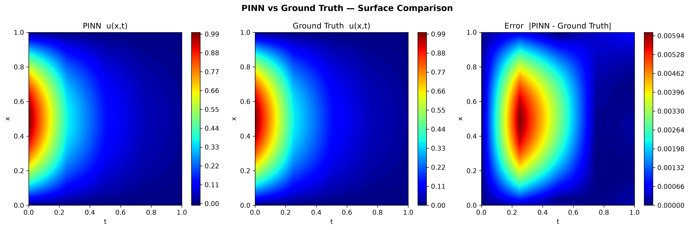

*Inverse mode* — same template, switched to **Inverse**, recovering the diffusivity coefficient (fixed at $0.4$ in Forward mode above) as an unknown parameter; the live convergence plot below shows the estimate settling onto its true value during training:

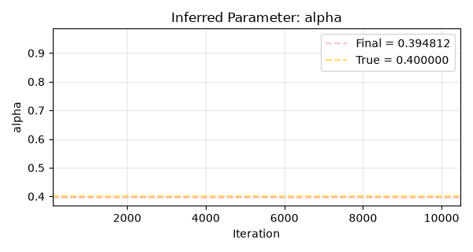

</details>

<details id="1d-allen-cahn">
<summary><strong>1D Allen-Cahn</strong></summary>

Benchmark problem after Wight & Zhao (2021) — see [References](#references).

$$\Large \frac{\partial u}{\partial t} = \gamma_1\frac{\partial^2 u}{\partial x^2} - \gamma_2 u^3 + \gamma_2 u, \qquad x \in [-1, 1],\ t \in [0, 1]$$

where $\gamma_1 = 0.0001$ and $\gamma_2 = 5$.

- **Initial condition:** $u(x, 0) = x^2\cos(\pi x)$
- **Boundary conditions:** Periodic
- **Geometry:** Interval
- **Time-Adaptive default:** on — $t \in [0,1]$ split into 4 steps of 0.25, L-BFGS transfer learning between steps
- **GUI recipe:** Dimension → 1D · Quick Examples → **1D Allen-Cahn**

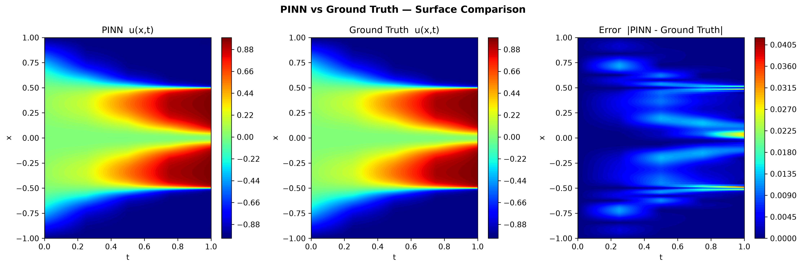

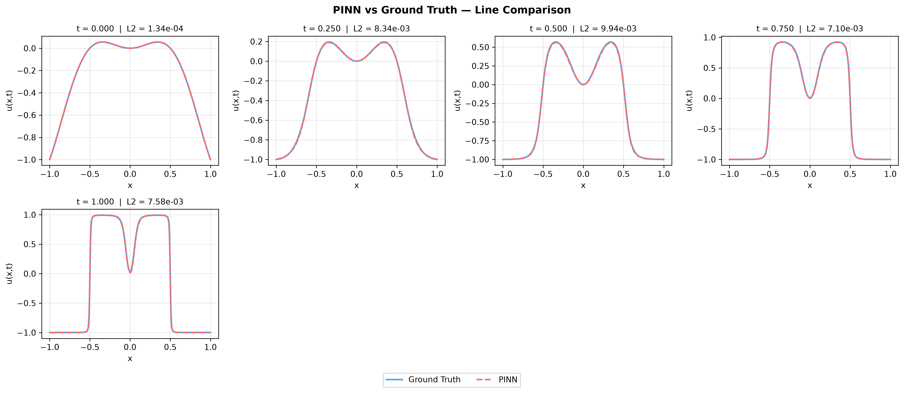

*Inverse mode* — same template, switched to **Inverse**, jointly recovering both $\gamma_1$ (diffusion) and $\gamma_2$ (reaction) as unknown parameters; the live convergence animation below shows each estimate settling onto its true value during training:

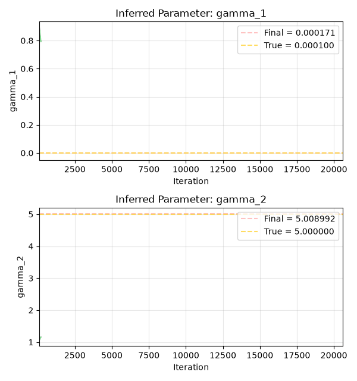

</details>

<details id="1d-burgers">
<summary><strong>1D Burgers</strong></summary>

Exact equation, initial and boundary conditions as in Raissi, Perdikaris & Karniadakis (2019) — see [References](#references).

$$\Large \frac{\partial u}{\partial t} + u\frac{\partial u}{\partial x} = \frac{0.01}{\pi}\frac{\partial^2 u}{\partial x^2}, \qquad x \in [-1, 1],\ t \in [0, 1]$$

- **Initial condition:** $u(x, 0) = -\sin(\pi x)$
- **Boundary conditions:** Dirichlet, $u = 0$ at both ends
- **Geometry:** Interval
- **GUI recipe:** Dimension → 1D · Quick Examples → **1D Burgers**

A shock forms near $x = 0$ as $t \to 1$; this template uses a larger fixed collocation count to resolve it rather than adaptive refinement.

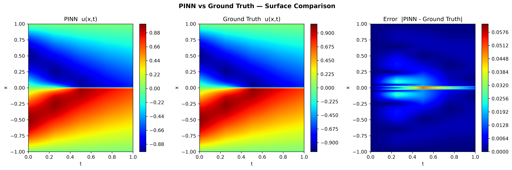

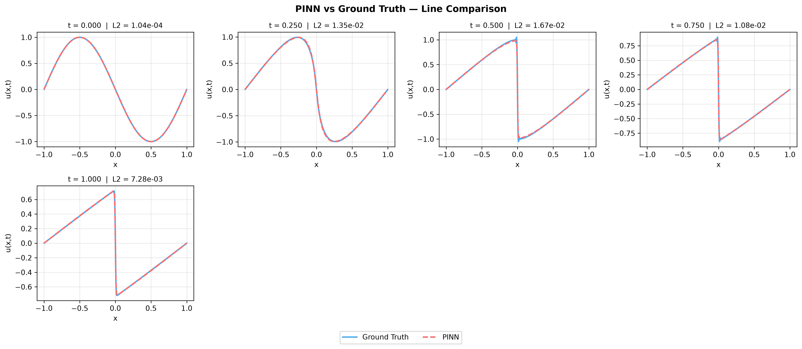

*Inverse mode* — same template, switched to **Inverse**, jointly recovering both coefficients of Raissi, Perdikaris & Karniadakis (2019)'s data-driven-discovery form of this equation, Appendix B, eq. B.1 — see [References](#references):

$$\Large \frac{\partial u}{\partial t} + \lambda_1 u\frac{\partial u}{\partial x} - \lambda_2\frac{\partial^2 u}{\partial x^2} = 0$$

with true values $\lambda_1 = 1.0$ and $\lambda_2 = 0.01/\pi$. $\lambda_1$'s initial guess starts at $0.1$ rather than $1.0$, since $1.0$ is already its true value. The live convergence animation below shows both estimates settling onto their true values during training:

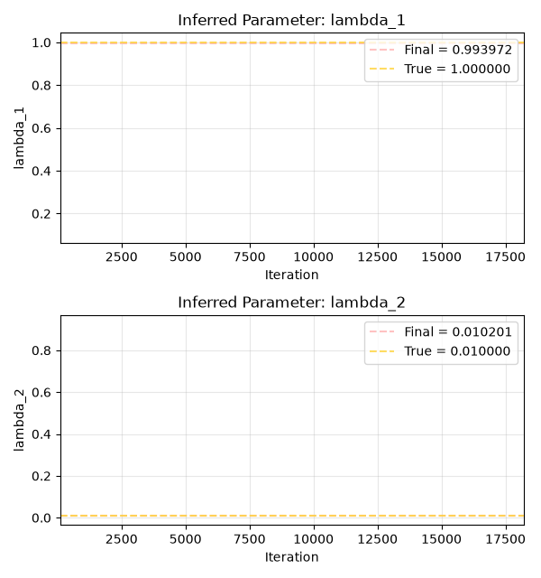

</details>

<details id="1d-schrödinger">
<summary><strong>1D Schrödinger</strong></summary>

Exact equation, initial condition, and periodic boundary condition as in Raissi, Perdikaris & Karniadakis (2019) — see [References](#references). The 1D nonlinear Schrödinger equation is complex-valued and represented here as two real, coupled outputs $h = u + iv$:

$$\Large i\,\frac{\partial h}{\partial t} + \frac{1}{2}\frac{\partial^2 h}{\partial x^2} + |h|^2 h = 0$$

which, writing $h = u + iv$ in real and imaginary parts, splits into the coupled real system PINNStudio actually solves:

$$\Large \frac{\partial u}{\partial t} + \frac{1}{2}\frac{\partial^2 v}{\partial x^2} + (u^2+v^2)v = 0$$

$$\Large \frac{\partial v}{\partial t} - \frac{1}{2}\frac{\partial^2 u}{\partial x^2} - (u^2+v^2)u = 0$$

$x \in [-5, 5]$, $t \in [0, \pi/2]$

- **Initial condition:** $h(x, 0) = 2\,\mathrm{sech}(x)$, i.e. $u(x,0) = 2/\cosh(x)$, $v(x,0) = 0$
- **Boundary conditions:** Periodic, enforced on both $h$ and its first $x$-derivative ($h_x(t,-5) = h_x(t,5)$), matching the paper's own condition
- **Geometry:** Interval
- **GUI recipe:** Dimension → 1D · Quick Examples → **1D Schrödinger**

The quantity plotted by default is $|h| = \sqrt{u^2+v^2}$ (a custom derived output), matching Figure 1 of the paper — not $u$ or $v$ individually, since neither alone is physically meaningful.

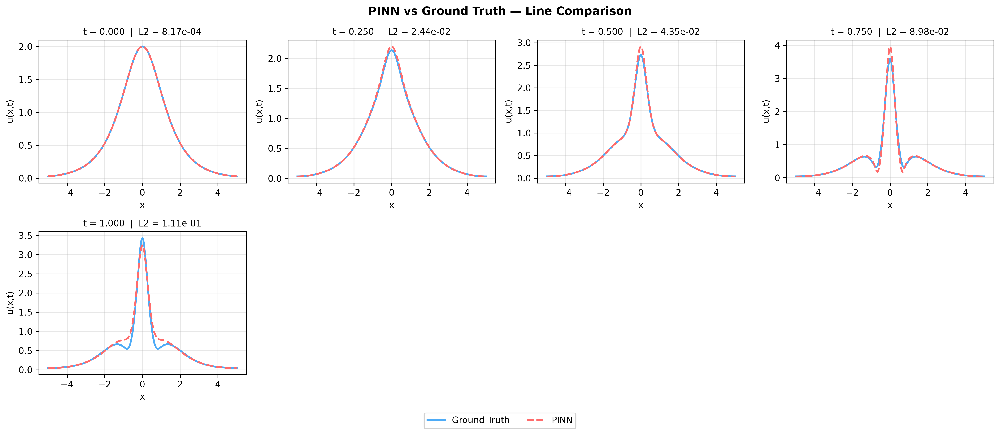

*Inverse mode* — same template, switched to **Inverse**, recovering the dispersion coefficient (fixed at $\frac{1}{2}$ in Forward mode above) as an unknown parameter; the live convergence plot below shows the estimate settling onto its true value during training:

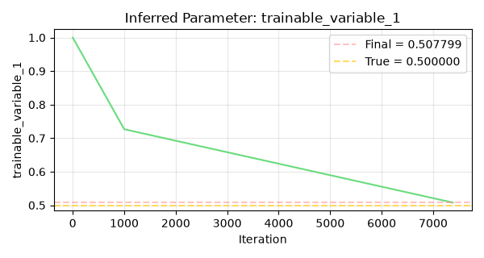

</details>

---

*The remaining templates are 2D problems — time-dependent `(x, y, t)` or steady-state `(x, y)`, as noted per template.*

<details id="2d-heat">
<summary><strong>2D Heat</strong></summary>

$$\Large \frac{\partial u}{\partial t} = 0.4\left(\frac{\partial^2 u}{\partial x^2} + \frac{\partial^2 u}{\partial y^2}\right), \qquad (x, y) \in [0, 1]^2,\ t \in [0, 1]$$

- **Initial condition:** $u(x, y, 0) = 0$
- **Boundary conditions:** Dirichlet $u = 1$ on the $x = 1$ edge; Neumann (insulated) on the other three
- **Geometry:** Rectangle
- **GUI recipe:** Dimension → 2D · Quick Examples → **2D Heat**

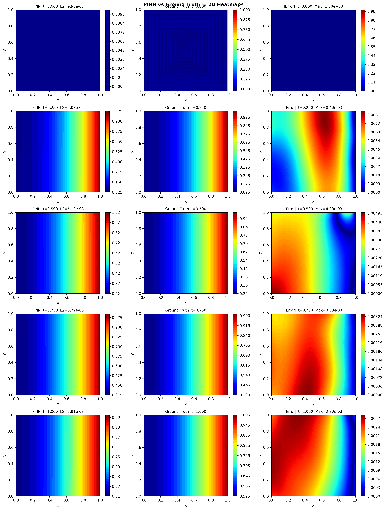

*Restore & Visualize* — the trained model restored from its saved checkpoint and re-animated without retraining:

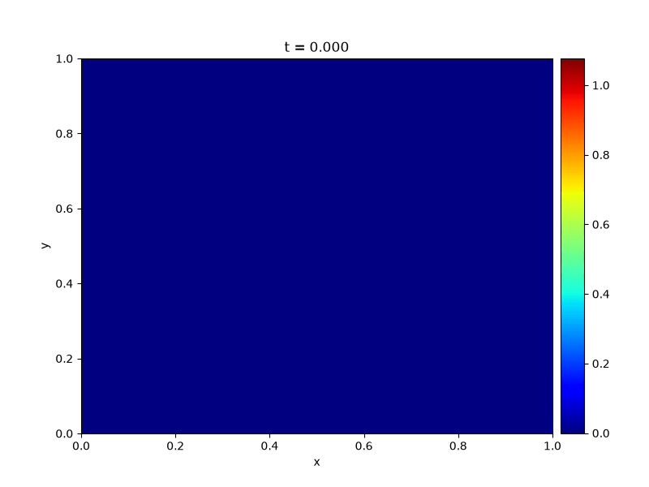

*Inverse mode* — same template, switched to **Inverse**, recovering the diffusivity coefficient (fixed at $0.4$ in Forward mode above) as an unknown parameter; the live convergence animation below shows the estimate settling onto its true value during training:

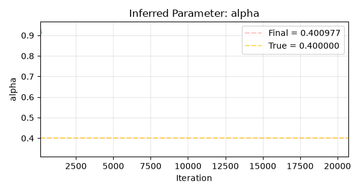

</details>

<details id="2d-allen-cahn-mattey--ghosh">
<summary><strong>2D Allen-Cahn (Mattey & Ghosh)</strong></summary>

Benchmark problem after Mattey & Ghosh (2022) — see [References](#references).

$$\Large \frac{\partial u}{\partial t} = c_1^2\left(\frac{\partial^2 u}{\partial x^2} + \frac{\partial^2 u}{\partial y^2}\right) - c_2(u^3 - u), \qquad (x, y) \in [0, 1]^2,\ t \in (0, 1]$$

where $c_1^2 = 0.0001$ and $c_2 = 1$.

- **Initial condition:** $u(x, y, 0) = \sin(4\pi x)\cos(4\pi y)$
- **Boundary conditions:** Periodic
- **Geometry:** Rectangle
- **Time-Adaptive default:** on — $t \in [0,1]$ split into 4 steps of 0.25, L-BFGS transfer learning between steps
- **GUI recipe:** Dimension → 2D · Quick Examples → **2D Allen-Cahn (Mattey & Ghosh)**

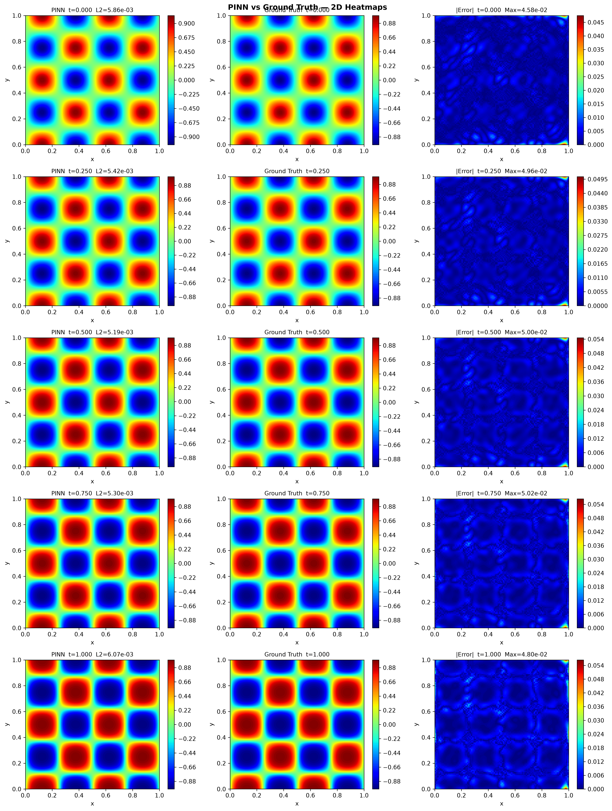

*Restore & Visualize* — the trained model restored from its saved checkpoint and re-animated without retraining:

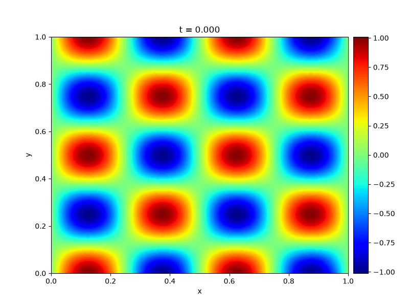

*Inverse mode* — same template, switched to **Inverse**, jointly recovering both $c_1^2$ (interfacial-thickness-squared) and $c_2$ (reaction) as unknown parameters; $c_2$'s initial guess starts at $0.1$ rather than $1.0$, since $1.0$ is already its true value. The live convergence animation below shows both estimates settling onto their true values during training:

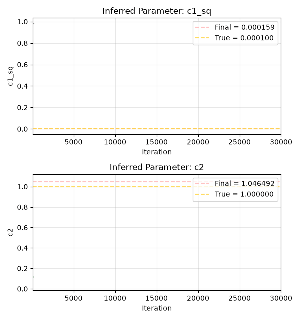

</details>

<details id="2d-allen-cahn-wight--zhao">
<summary><strong>2D Allen-Cahn (Wight & Zhao)</strong></summary>

Benchmark problem after Wight & Zhao (2021) — see [References](#references). This is the paper's own shrinking-circle-interface benchmark, posed there for a field it calls $\phi$ (PINNStudio's $u$) with rate constant $\lambda$ and interface-width parameter $\varepsilon$ (eq. 3.11):

$$\Large \frac{\partial u}{\partial t} = \lambda\left(\varepsilon^2\left(\frac{\partial^2 u}{\partial x^2} + \frac{\partial^2 u}{\partial y^2}\right) - u^3 + u\right), \qquad (x, y) \in [0, 1]^2,\ t \in [0, 10]$$

where $\lambda = 10$ and $\varepsilon = 0.025$, matching the paper's own values ($\lambda\varepsilon^2 = 0.00625$ is the effective diffusion coefficient).

- **Initial condition:** a smooth circular interface, $u(x, y, 0) = \tanh\left(\dfrac{0.35 - \sqrt{(x-0.5)^2 + (y-0.5)^2}}{2\varepsilon}\right)$ (paper's eq. 3.12)
- **Boundary conditions:** Periodic
- **Geometry:** Rectangle
- **Time-Adaptive default:** on — $t \in [0,10]$ is a wide window for a single pass, so this template splits it into 10 steps of 1 (`0→1, 1→2, ..., 9→10`), L-BFGS transfer learning between steps
- **GUI recipe:** Dimension → 2D · Quick Examples → **2D Allen-Cahn (Wight & Zhao)**

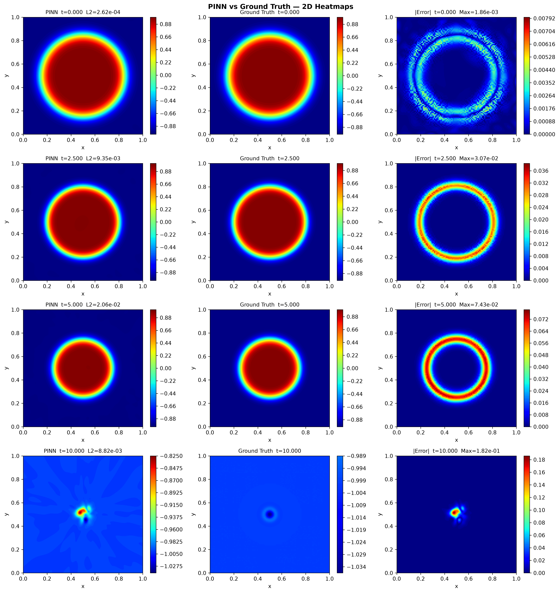

*Restore & Visualize* — the trained model restored from its saved checkpoint and re-animated without retraining:

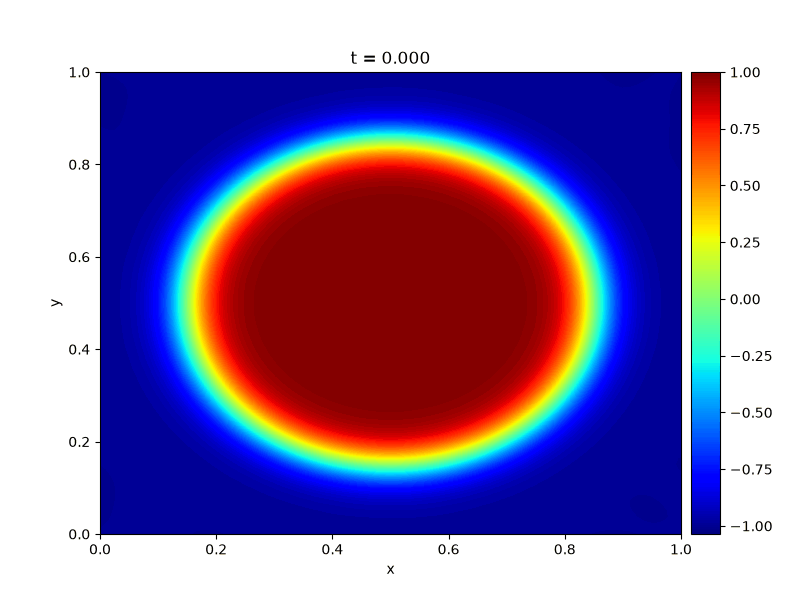

*Inverse mode* — same template, switched to **Inverse**, jointly recovering the two coefficients exactly as they appear in the PDE box — the reaction-term coefficient $\lambda$ and the lumped diffusion-term coefficient $\lambda\varepsilon^2$ (not $\varepsilon$ on its own):

$$\Large \frac{\partial u}{\partial t} = (\lambda\varepsilon^2)\left(\frac{\partial^2 u}{\partial x^2} + \frac{\partial^2 u}{\partial y^2}\right) - \lambda(u^3 - u)$$

with true values $\lambda = 10$ and $\lambda\varepsilon^2 = 0.00625$. The live convergence animation below shows both estimates settling onto their true values during training:

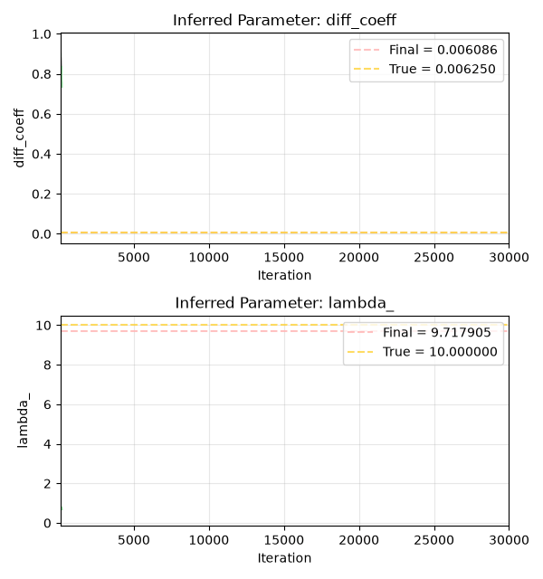

</details>

<details id="2d-burgers-mathias">
<summary><strong>2D Burgers (Mathias)</strong></summary>

Physics after Mathias, de Almeida, de Barros, Coelho, et al. (2022) — see [References](#references). A coupled, two-output system for the velocity components $U$, $V$, with kinematic viscosity $\nu = \dfrac{0.01}{\pi}$:

$$\Large \frac{\partial U}{\partial t} + U\frac{\partial U}{\partial x} + V\frac{\partial U}{\partial y} = \nu\left(\frac{\partial^2 U}{\partial x^2} + \frac{\partial^2 U}{\partial y^2}\right)$$

$$\Large \frac{\partial V}{\partial t} + U\frac{\partial V}{\partial x} + V\frac{\partial V}{\partial y} = \nu\left(\frac{\partial^2 V}{\partial x^2} + \frac{\partial^2 V}{\partial y^2}\right)$$

$(x, y) \in [0, 1]^2$, $t \in [0, 1]$

- **Initial condition:** $U(x,y,0) = \sin(2\pi x)\sin(2\pi y)$, $\ V(x,y,0) = \sin(\pi x)\sin(\pi y)$
- **Boundary conditions:** Dirichlet, $U = V = 0$ on all four edges
- **Geometry:** Rectangle
- **Network:** 4 hidden layers × 128 neurons — wider than PINNStudio's global default (3 × 64), which gave better results for this coupled two-output velocity field
- **Time-Adaptive default:** on — $t \in [0,1]$ split into 4 steps of 0.25, L-BFGS transfer learning between steps
- **GUI recipe:** Dimension → 2D · Quick Examples → **2D Burgers (Mathias)**

This template reproduces the paper's own PDE, domain, and initial/boundary conditions with PINNStudio's standard soft-constrained loss and plain MLP network — not the paper's own sparse-data augmentation or hard-constrained output layer, which are outside this template's scope.

PINN solution animated over time, for each of the two coupled outputs:

<table>
<tr>
<td width="50%" align="center">
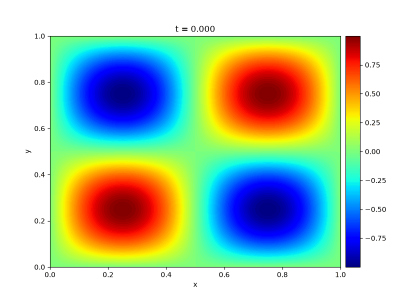
<sub><strong>U</strong></sub>
</td>
<td width="50%" align="center">
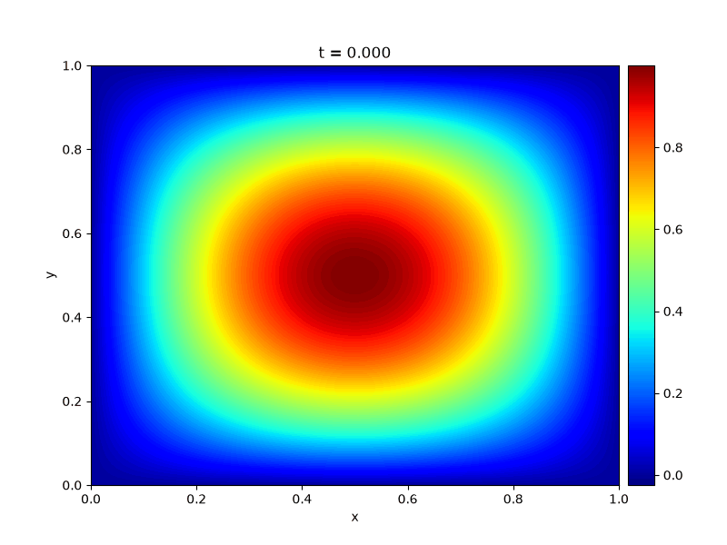
<sub><strong>V</strong></sub>
</td>
</tr>
</table>

Error Analysis — PINN vs Ground Truth, for each output:

<table>
<tr>
<td width="50%" align="center">
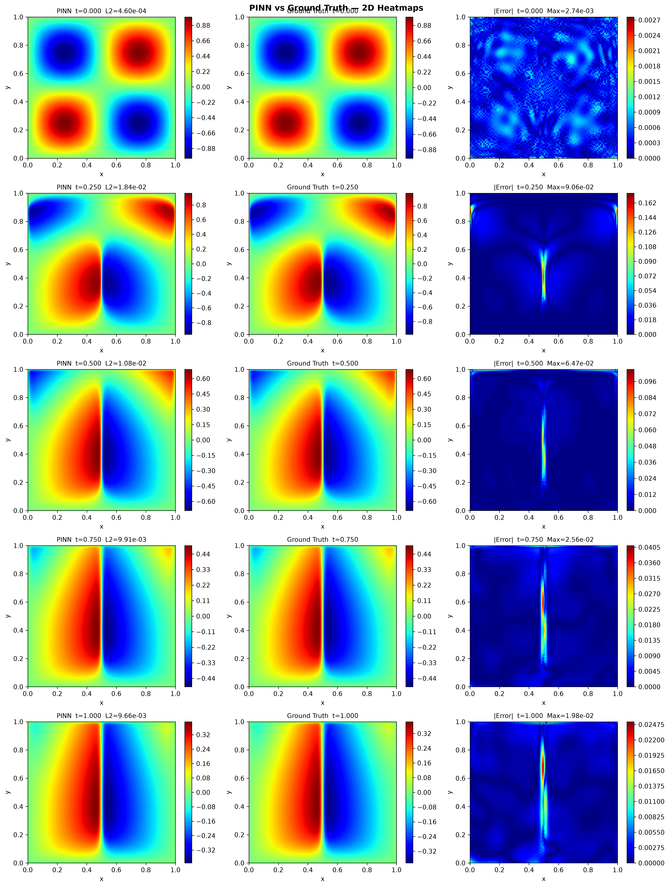
<sub><strong>U</strong></sub>
</td>
<td width="50%" align="center">
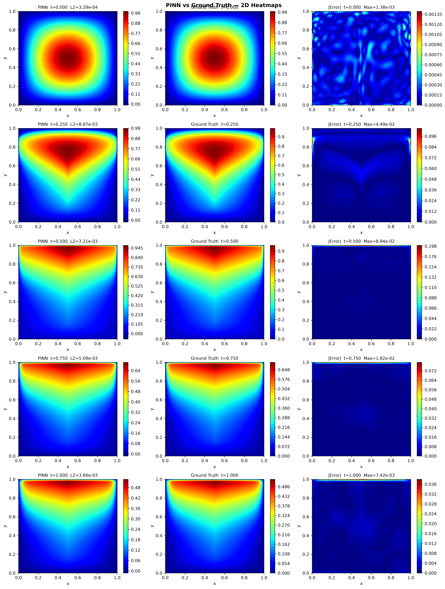
<sub><strong>V</strong></sub>
</td>
</tr>
</table>

*Inverse mode* — same template, switched to **Inverse**, recovering the shared viscosity $\nu$, true value $0.01/\pi$.

</details>

<details id="2d-poisson-l-shape">
<summary><strong>2D Poisson (L-Shape)</strong></summary>

A classic re-entrant-corner benchmark — the Poisson equation on an L-shaped domain (a unit square with a quadrant notched out), steady-state (no time axis). This is the same benchmark used as a demonstration example in the original DeepXDE paper — see Lu, Meng, Mao & Karniadakis (2021) under [References](#references).

$$\Large -\frac{\partial^2 u}{\partial x^2} - \frac{\partial^2 u}{\partial y^2} = 1, \qquad (x, y) \in \Omega_{L}$$

- **Boundary conditions:** Dirichlet, $u = 0$ on the whole boundary
- **Geometry:** Polygon, vertices $(0,0), (1,0), (1,-1), (-1,-1), (-1,1), (0,1)$
- **GUI recipe:** Dimension → 2D · Quick Examples → **2D Poisson (L-Shape)**

The re-entrant corner at the origin produces a solution singularity that's a standard stress-test for numerical solvers, PINNs included.

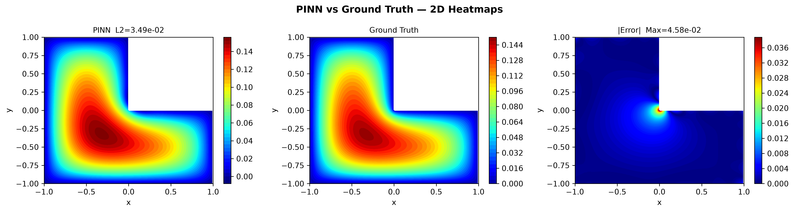

</details>

<details id="2d-poisson-disk">
<summary><strong>2D Poisson (Disk)</strong></summary>

The Poisson equation on the unit disk, steady-state (no time axis).

$$\Large -\frac{\partial^2 u}{\partial x^2} - \frac{\partial^2 u}{\partial y^2} = 1, \qquad x^2 + y^2 \le 1$$

- **Boundary conditions:** Dirichlet, $u = 0$ on the boundary circle
- **Geometry:** Disk, center $(0,0)$, radius $1$
- **GUI recipe:** Dimension → 2D · Quick Examples → **2D Poisson (Disk)**

A companion to the L-Shape template above, on a smooth (curved, non-singular) boundary instead.

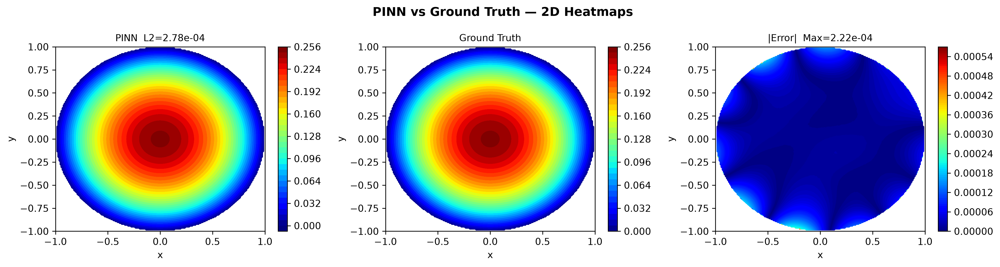

</details>

---

*The remaining templates are 3D problems — time-dependent `(x, y, z, t)` or steady-state `(x, y, z)`, as noted per template.*

<details id="3d-heat">
<summary><strong>3D Heat</strong></summary>

The 2D Heat problem extended with a $z$ axis — diffusion in a unit cube.

$$\Large \frac{\partial u}{\partial t} = 0.4\left(\frac{\partial^2 u}{\partial x^2} + \frac{\partial^2 u}{\partial y^2} + \frac{\partial^2 u}{\partial z^2}\right), \qquad (x, y, z) \in [0, 1]^3,\ t \in [0, 1]$$

- **Initial condition:** $u(x, y, z, 0) = 0$
- **Boundary conditions:** Dirichlet $u = 1$ on the $x = 1$ face; Neumann (insulated) on the other five
- **Geometry:** Cuboid
- **GUI recipe:** Dimension → 3D · Quick Examples → **3D Heat**

Time-Adaptive Training is fully supported for this template if you turn it on — see the note on 3D grid resolution under [Time-Adaptive training](#training) in Features before picking a large "IC grid resolution" value.

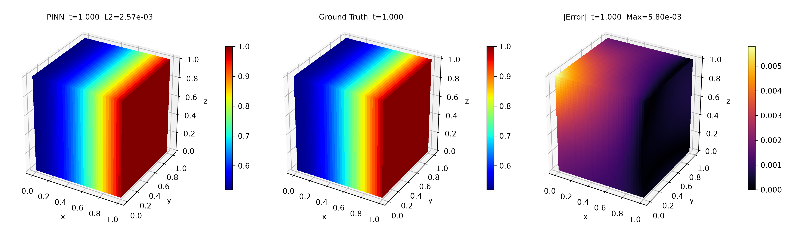

*Restore & Visualize* — the trained model restored from its saved checkpoint and re-animated without retraining:

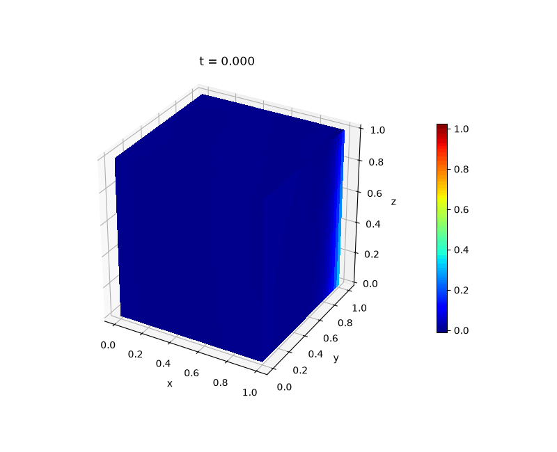

*Inverse mode* — same template, switched to **Inverse**, recovering the diffusivity coefficient (fixed at $0.4$ in Forward mode above) as an unknown parameter; the live convergence animation below shows the estimate settling onto its true value during training:

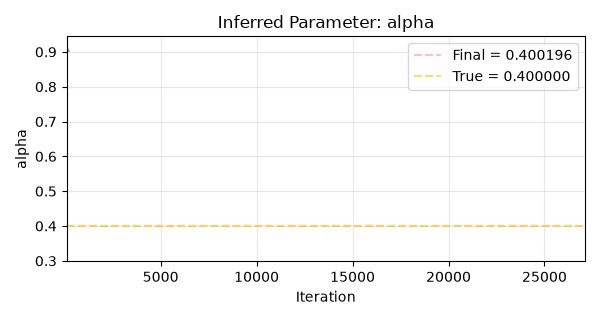

</details>

<details id="3d-poisson-sphere">
<summary><strong>3D Poisson (Sphere)</strong></summary>

The Poisson equation on the unit ball, steady-state (no time axis) — the 3D companion to the 2D Poisson (Disk) template above.

$$\Large -\frac{\partial^2 u}{\partial x^2} - \frac{\partial^2 u}{\partial y^2} - \frac{\partial^2 u}{\partial z^2} = 1, \qquad x^2 + y^2 + z^2 \le 1$$

- **Boundary conditions:** Dirichlet, $u = 0$ on the boundary sphere
- **Geometry:** Sphere, center $(0,0,0)$, radius $1$
- **GUI recipe:** Dimension → 3D · Quick Examples → **3D Poisson (Sphere)**

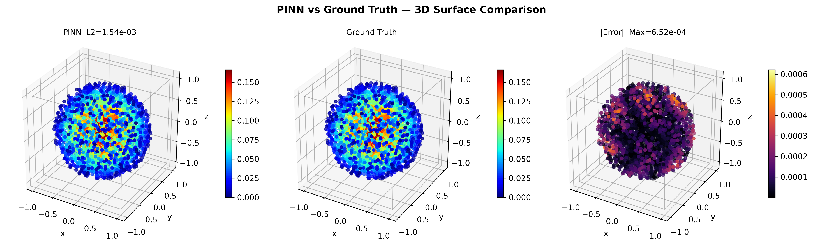

*Inverse mode* — same template, switched to **Inverse**, recovering the source term (fixed at $1$ in Forward mode above) as an unknown parameter; the live convergence plot below shows the estimate settling onto its true value during training:

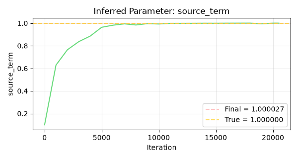

</details>

> **Tip:** Accuracy can generally be improved by refining the time discretization — use more, smaller **Time Adaptive** step groups (a finer time step per phase) rather than one large training pass, or increase collocation points for finer spatial/adaptive refinement of the residual. Several templates above already default to Time-Adaptive for this reason; add or adjust step groups for any template — in any dimension — from the *Adaptive Training* panel.

## Getting Started with Your Own PDE

The templates above cover twelve specific problems, but PINNStudio isn't limited to them — every field in those templates is just a starting point you can overwrite. Here's a complete walkthrough for a PDE that **isn't** a built-in template, to show the general path from "I have an equation" to "I have a trained PINN."

We'll use the **Fisher-KPP equation**, a classic reaction-diffusion model of a population (or concentration front) that diffuses and grows logistically toward a carrying capacity of 1:

$$\Large \frac{\partial u}{\partial t} = D\frac{\partial^2 u}{\partial x^2} + r\,u(1-u), \qquad x \in [0, 1],\ t \in [0, 1]$$

with $D = 0.01$, $r = 1$, a localized initial bump, and no-flux (Neumann) boundaries — none of the twelve templates have a logistic nonlinearity like this one.

1. **Dimension & geometry.** Leave Dimension on **1D** (the default) — no geometry selector is needed outside 2D/3D.
2. **PDE residual.** In the free-form PDE editor, enter the residual (moving everything to one side):
   ```
   du_t - 0.01*du_xx - 1.0*u*(1 - u)
   ```
   This is exactly the `d<output>_<vars>` convention described under [Free-form, multi-output PDE editor](#problem-setup) — `du_t` is $\partial u/\partial t$, `du_xx` is $\partial^2 u/\partial x^2$, and the coefficients $D=0.01$ and $r=1$ are just written inline.
3. **Domain.** Set `x_min = 0`, `x_max = 1`, `t_min = 0`, `t_max = 1`. Leave Steady-state **off** — this is a time-dependent problem.
4. **Initial condition.** A localized bump that will spread and saturate toward 1:
   ```
   exp(-50*(x-0.5)**2)
   ```
5. **Boundary conditions.** Add two rows in the Boundary Conditions panel, both **Neumann**, value `0` (no-flux — the population can't leave through either edge):
   - `x <= 0`
   - `x >= 1`
6. **Network & training.** The defaults (a handful of hidden layers, Adam then L-BFGS) are a reasonable starting point for a problem this size — adjust layer/neuron counts or add Time-Adaptive stepping later if convergence needs help.
7. **Solve.** Click **Solve** and watch the Training Log stream progress; the loss and solution plots populate once training finishes. Try the axis-swap option in Plot Settings on the resulting Surface plot — it's the same option described under [Configurable result plotting](#analysis--output).
8. **Error Analysis (optional).** Since this isn't a bundled template, there's no reference data pre-loaded — Error Analysis is entirely optional here, but if you have your own reference solution (from a separate FEM/FD solver, say), point the Error Analysis dialog at it the same way the built-in templates do automatically.

<table>
<tr>
<td width="33%" align="center">
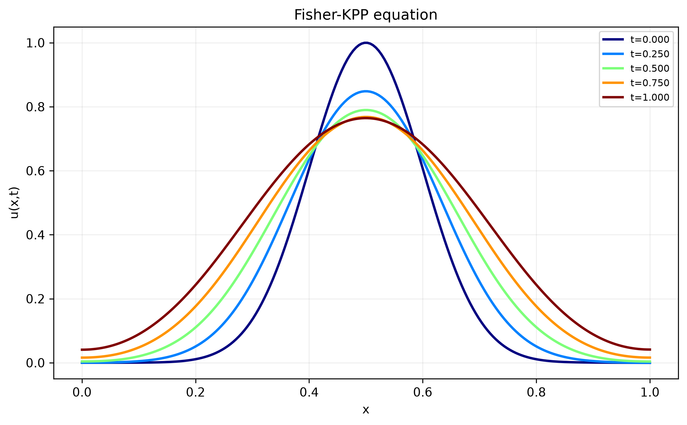
<sub>Line comparison</sub>
</td>
<td width="33%" align="center">
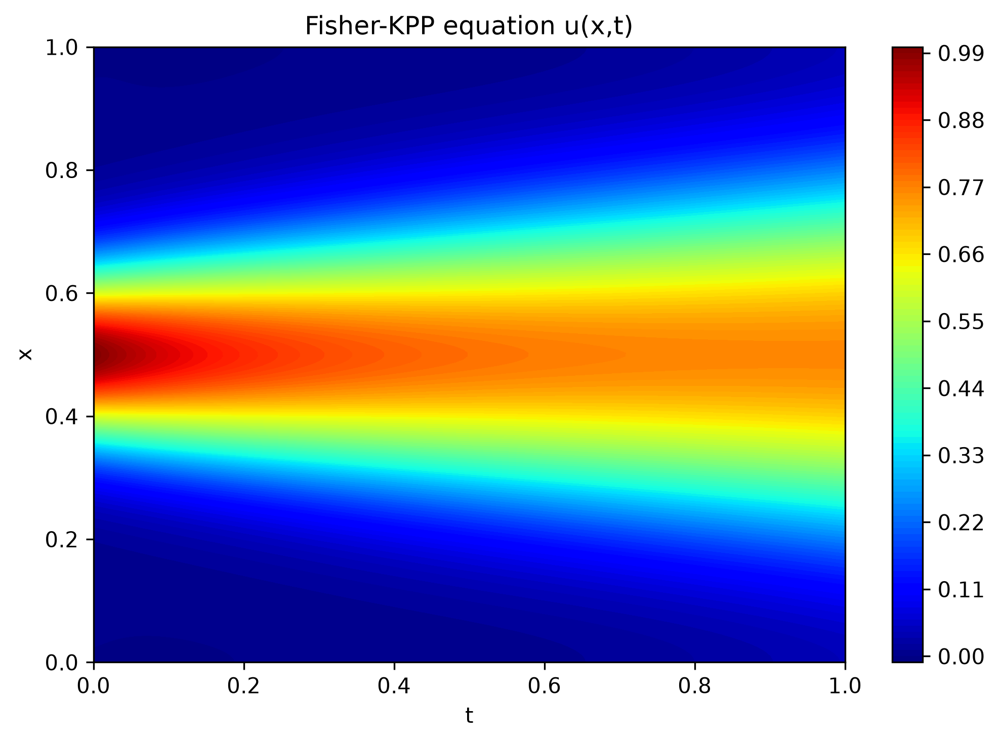
<sub>Surface</sub>
</td>
<td width="33%" align="center">
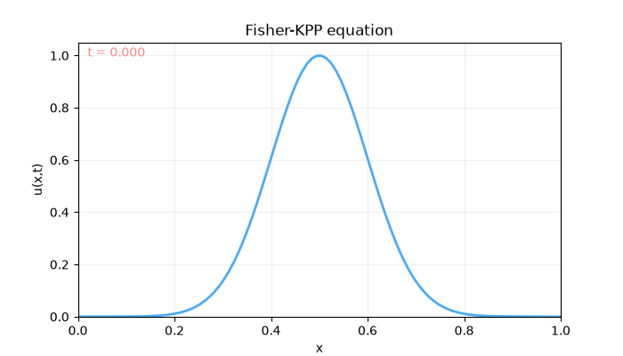
<sub>Animation</sub>
</td>
</tr>
</table>

From here, the same eight steps apply to essentially any PDE expressible with the derivative syntax under [Free-form, multi-output PDE editor](#problem-setup) — swap in your own residual, domain, and conditions.

## How It Works

PINNStudio doesn't wrap DeepXDE at runtime — it **generates code**. Every setting in the GUI maps to a field on a `PINNConfig` dataclass ([`pinnstudio/core/config.py`](pinnstudio/core/config.py)); clicking **Solve** passes that config to [`codegen.py`](pinnstudio/core/codegen.py), which writes out a complete, standalone DeepXDE/PyTorch script, and [`runner.py`](pinnstudio/core/runner.py) executes it as a subprocess, streaming stdout back into the Training Log panel in real time.

Because the output of every run is an ordinary Python script, you can take it and run it outside the GUI, hand it to a cluster job, or use it as a starting point for a hand-written DeepXDE project.

## Citation

If PINNStudio is useful in your work, please cite it — see [`CITATION.cff`](CITATION.cff):

```bibtex
@software{khan2026pinnstudio,
  author  = {Khan, Asfandyar and Mamivand, Mahmood},
  title   = {PINNStudio: A No-Code Scientific Computing Environment for Forward and Inverse Physics-Informed Neural Networks},
  year    = {2026},
  url     = {https://github.com/AsfandyarKhan72/PINNStudio}
}
```

## References

- Lu, L., Meng, X., Mao, Z., & Karniadakis, G. E. (2021). DeepXDE: A deep learning library for solving differential equations. *SIAM Review*, 63(1), 208–228. https://doi.org/10.1137/19M1274067
- Raissi, M., Perdikaris, P., & Karniadakis, G. E. (2019). Physics-informed neural networks: A deep learning framework for solving forward and inverse problems involving nonlinear partial differential equations. *Journal of Computational Physics*, 378, 686–707. https://doi.org/10.1016/j.jcp.2018.10.045
- Mattey, R., & Ghosh, S. (2022). A novel sequential method to train physics informed neural networks for Allen-Cahn and Cahn-Hilliard equations. *Computer Methods in Applied Mechanics and Engineering*, 390, 114474. https://doi.org/10.1016/j.cma.2021.114474
- Wight, C. L., & Zhao, J. (2021). Solving Allen-Cahn and Cahn-Hilliard equations using the adaptive physics informed neural networks. *Communications in Computational Physics*, 29(3), 930–954. https://doi.org/10.4208/cicp.OA-2020-0086
- Mathias, D. L., de Almeida, T. B. F., de Barros, G. F., Coelho, L. et al. (2022). Augmenting a Physics-Informed Neural Network for the 2D Burgers Equation by Addition of Solution Data Points. *Brazilian Conference on Intelligent Systems (BRACIS 2022)*. https://arxiv.org/abs/2301.07824

## Acknowledgment

PINNStudio is built on [DeepXDE](https://github.com/lululxvi/deepxde) (Lu et al., 2021) and PyQt6. Special thanks to Lu Lu and the DeepXDE team — DeepXDE is the scientific-machine-learning engine every generated script in this project ultimately runs on, and PINNStudio wouldn't exist without it. The 1D Burgers and 1D Schrödinger Quick Example templates follow the problem setups in Raissi, Perdikaris & Karniadakis (2019); the 2D Burgers template follows Mathias et al. (2022); the Allen-Cahn templates follow Mattey & Ghosh (2022) and Wight & Zhao (2021); the 2D Poisson (L-Shape) template follows the original DeepXDE paper's own demonstration example — see [References](#references).

Developed under the supervision of Prof. Mahmood Mamivand, Computational Materials Design Lab, Boise State University.

The authors appreciate the support of the National Science Foundation grant DMR-2142935. We would like to acknowledge the high-performance computing support of the Borah compute cluster (DOI: 10.18122/oit/3/boisestate) provided by Boise State University's Research Computing Department.

## Contributing

Bug reports, feature requests, and pull requests are welcome — see [`CONTRIBUTING.md`](CONTRIBUTING.md).

## Contact

Asfandyar Khan
PhD Candidate, Materials Science and Engineering
Boise State University
Email: [asfandyarkhan@u.boisestate.edu](mailto:asfandyarkhan@u.boisestate.edu)

## License

Released under the MIT License. See [`LICENSE`](LICENSE) for details.
